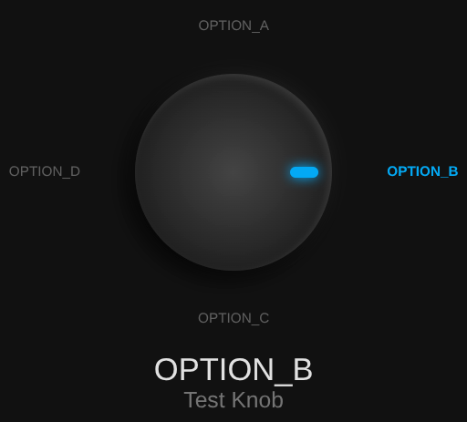

# Rotary Knob Card for Home Assistant

A beautiful, tactile rotary knob dashboard card that controls an `input_select` entity. 

## Features
- **Intuitive Control**: Click the knob to cycle through `input_select` options.
- **Smooth Animation**: Visual rotation matches the current state of the entity.
- **Neumorphic Design**: Modern dark-themed aesthetic that fits perfectly in Home Assistant.



## Installation via HACS

1. Open **HACS** in your Home Assistant instance.
2. Click the **three dots (⋮)** in the top right corner and select **Custom repositories**.
3. Paste the following URL: `https://github.com/fstancu/rotary_knob_card`
4. Select **Dashboard** as the category and click **Add**.
5. Now, search for **Rotary Knob Card** in the HACS store and click **Download**.
6. **Restart Home Assistant.**

### Usage
Add a **Manual** card to your dashboard with the following YAML:

```yaml
type: custom:rotary-knob-card
entity: input_select.<your_select_entity>
name: "<My Rotary Knob>"
```

## Configuration

| Option            | Type    | Default | Description                                                                 |
| ------------------ | ------- | ------- | ----------------------------------------------------------------------------- |
| `entity`          | string  | —       | **Required.** `input_select` entity to control.                             |
| `name`             | string  | `"Rotary Control"` | Text shown under the state label.                                |
| `knob_size`       | number  | `140`   | Diameter of the knob in px. Everything else (indicator, label ring) scales from this. |
| `label_gap`        | number  | `34`    | Distance in px between the knob's edge and the ring of option labels.       |
| `label_max_width` | number  | `92`    | Max width in px per option label before it wraps to a second line.          |
| `padding`          | number  | `24`    | Padding in px around the whole card content.                                |
| `show_labels`     | boolean | `true`  | Show/hide the ring of option labels around the knob.                        |
| `show_state`       | boolean | `true`  | Show/hide the large current-state text below the knob.                     |
| `show_name`        | boolean | `true`  | Show/hide the `name` subtitle below the state text.                        |

### Examples

Compact card:

```yaml
type: custom:rotary-knob-card
entity: input_select.heating_state
name: "AC Heating State"
knob_size: 80
label_gap: 18
padding: 10
```

Minimal card (knob only, no labels or text):

```yaml
type: custom:rotary-knob-card
entity: input_select.heating_state
show_labels: false
show_state: false
show_name: false
```
